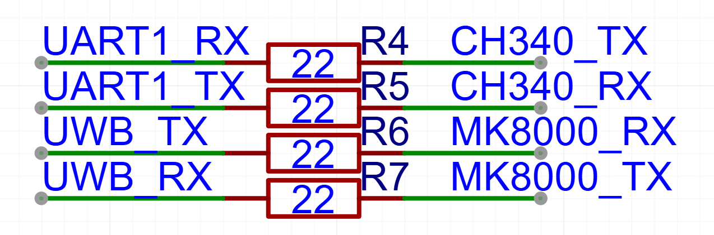

## Wireless UWB 开发板

### 说明

USB接口用于锂电池充电(TP4056)以及串口(CH340C)

板载开关控制锂电池与4V2网络的连接，LDO将4V2转换为3V3供各芯片使用

锂电池使用1S(4.2V)，电压检测ADC数值乘以2倍为实际电压

板子引出两个LED和两个GPIO

板子引出SWD接口供烧录和调试

MK8000的UART接口连接到STM32G0的UART2，并且通过排针引出供调试使用

STM32G0的UART1接口通过排针引出，并且连接到CH340C，用于调试

通过选择焊接以下电阻进行内部连接控制：

